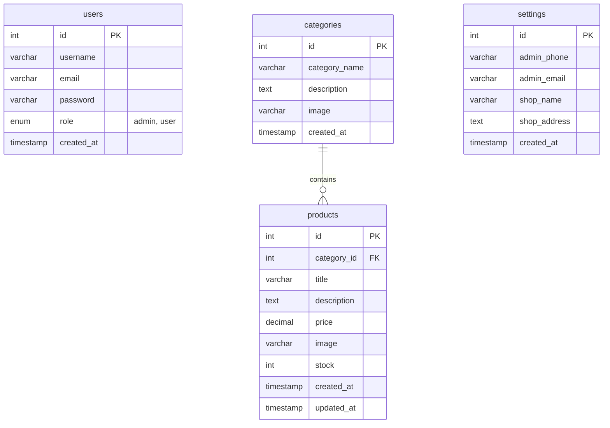

# 💡 LUXLIGHT — Premium Lighting Solutions

[](https://www.php.net/)
[](https://www.mysql.com/)
[](https://tailwindcss.com/)
[](https://getbootstrap.com/)
[](https://opensource.org/licenses/MIT)

**LUXLIGHT** is a modern, premium e-commerce web application dedicated to designer lamps, chandeliers, and high-end residential and workspace lighting solutions. Built on a PHP & MySQL foundation, the application combines a responsive customer-facing shopping front-end with a powerful administrative management dashboard.

---

## 🌟 Key Features

### 🛒 Customer-Facing Portal
- **Interactive Home Page**: Features a stunning, full-screen hero section, curated categories, and a showcase of featured lighting products.
- **Dynamic Category Filtering**: Browse premium lighting products by specific categories (e.g., Pendant Lights, Modern Lamps, Wall Sconces).
- **Product Details View**: Deep-dive pages displaying high-quality product images, item descriptions, prices, stock levels, and quick-purchase details.
- **Contact & Inquiry Form**: Allows customers to easily message support or administrative teams regarding bulk custom installations.

### ⚙️ Administrative Dashboard (Admin Panel)
- **Visual Analytics**: An intuitive dashboard displaying key stats (e.g., total products count, categories count, active setting information).
- **Product Management (CRUD)**: Create, read, update, and delete product listings, complete with image uploads.
- **Category Management**: Edit, create, and remove product categories to keep inventory structured.
- **Global Shop Settings**: Configure contact emails, telephone lines, and physical address coordinates across the store dynamically.
- **Role-Based Authentication**: Secure admin logins keeping management tools shielded from regular users.

---

## 🛠️ Technology Stack

| Tier | Technologies Used |
| :--- | :--- |
| **Frontend** | HTML5, Tailwind CSS, Bootstrap 5, Font Awesome v6, JavaScript |
| **Backend** | PHP 8.x (using PDO for secure, prepared SQL interactions) |
| **Database** | MySQL 5.7+ / 8.x |
| **Aesthetics** | Modern dark/light typography contrast, smooth hover transitions, grid systems |

---

## 📐 System Architecture & Database Schema

The database model is built with foreign keys to ensure referential integrity between categories and products. Below is the Entity-Relationship Diagram (ERD):



---

## 📂 Project Structure

A clean, modular layout separates layout components, uploads, administrator views, and configuration:

```text
lighting-ecommerce/
│
├── admin/                     # Admin Dashboard Panel
│   ├── assets/                # CSS and scripts specific to Admin
│   ├── categories.php         # Add, view, edit categories
│   ├── dashboard.php          # Stats overview page
│   ├── index.php              # Admin login page
│   ├── logout.php             # Session destroyer
│   ├── products.php           # Catalog CRUD panel
│   └── settings.php           # Store configuration
│
├── config/                    # Configuration Files
│   ├── config.php             # Base URL definition & session starts
│   └── database.php           # MySQL PDO connection settings
│
├── css/                       # Stylesheets
│   └── style.css              # Custom styling definitions
│
├── database/                  # Schema SQL backups
│   └── lighting_shop.sql      # Main database SQL initialization script
│
├── images/                    # UI icons and static visuals
│
├── includes/                  # Reusable Layout Components
│   ├── footer.php             # Standard footer script
│   ├── functions.php          # Price formatter and utility functions
│   ├── header.php             # Document header, metadata, CSS links
│   └── navbar.php             # Main site navigation menu
│
├── js/                        # JavaScript assets
│
├── uploads/                   # User-uploaded files (dynamically written)
│   └── products/              # Stored images for product listings
│
├── user/                      # User-facing listing directories
│   ├── contact.php            # Store inquiry form
│   ├── product-detail.php     # Product detail display page
│   └── products.php           # Shop catalog and filter page
│
├── index.php                  # Home page landing
└── README.md                  # Project documentation (this file)
```

---

## 🚀 Installation & Setup

Follow these simple steps to run LUXLIGHT on your local server environment:

### Prerequisites
- Install a PHP/MySQL stack such as **XAMPP**, **WAMP**, **MAMP**, or **Laragon**.
- Make sure PHP 8.0 or higher and MySQL are enabled.

### 1. Clone or Move Project Files
Download the codebase and copy the folder inside your web server directory (e.g., `htdocs` for XAMPP):
```bash
C:/xampp/htdocs/lighting-ecommerce/
```

### 2. Configure Local Database
1. Launch **phpMyAdmin** or your preferred database client.
2. Create a new database named `lighting_shop`:
   ```sql
   CREATE DATABASE lighting_shop;
   ```
3. Select `lighting_shop` and import the schema file:
   - File Path: database/lighting_shop.sql

### 3. Update Database Connection Settings
Open `config/database.php` and adjust credentials to match your local database settings if necessary:
```php
define('DB_HOST', 'localhost');
define('DB_USER', 'root'); // Your database username
define('DB_PASS', '');     // Your database password
define('DB_NAME', 'lighting_shop');
```

And check `config/config.php` to ensure the Base URL points correctly:
```php
define('BASE_URL', 'http://localhost/lighting-ecommerce/');
```

### 4. Admin Access & Credentials
You can log in to the admin panel by visiting: `http://localhost/lighting-ecommerce/admin/index.php`

Use the default administrative credentials defined in the database:
- **Username**: `admin`
- **Password**: `admin123`

---

## 📄 License
This project is open-source and released under the [MIT License](LICENSE).
